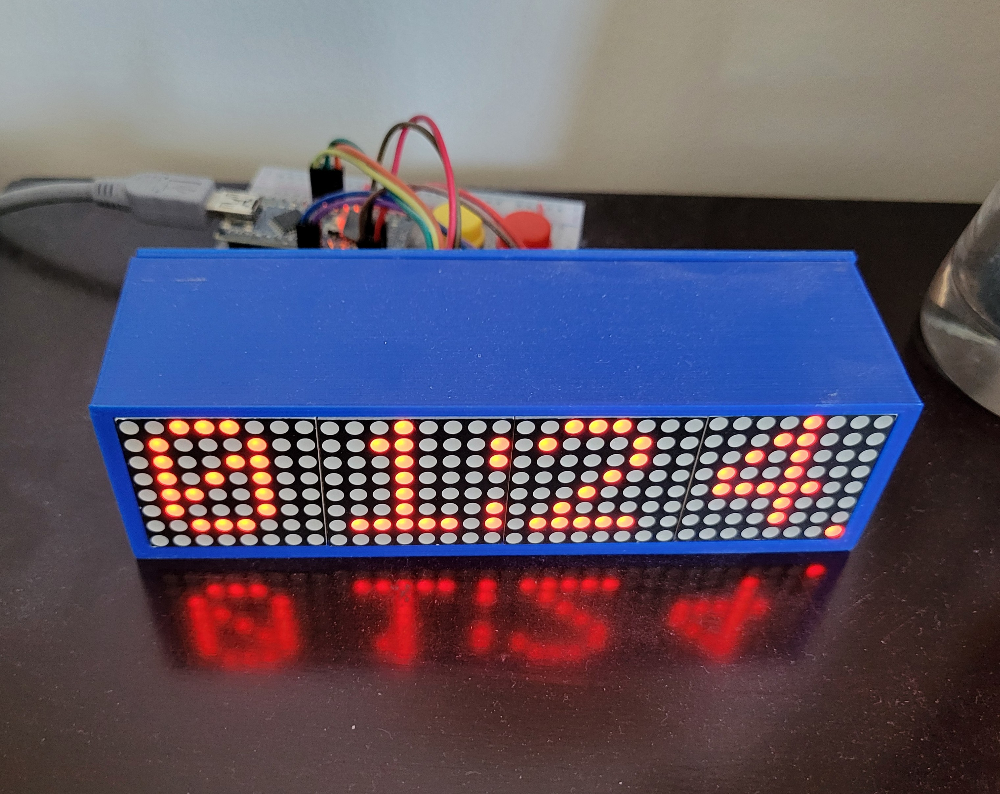
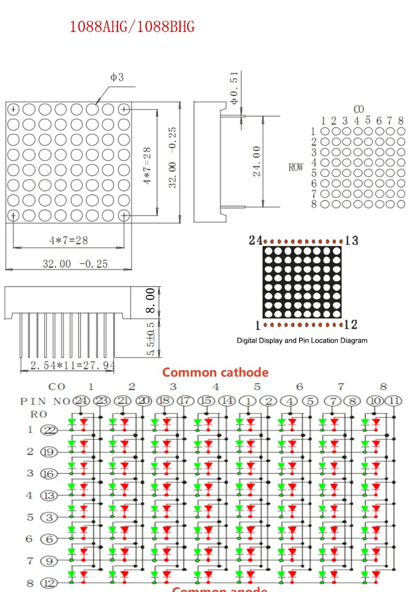

## 2025-05-19
Four years ago, I built a custom clock with off-the-shelf parts (Arduino Nano, DS3231 breakout, 32x8 MAX7219 LED Matrix, all on a breadboard with 2 buttons). Although it has worked very reliably, only needing a few battery replacements and resetting the nano a few times, I want to make a custom solution.

*the current solution ✨*

### Plans
Displays: https://www.aliexpress.com/item/1005007029570407.html
bicolour 8x8 led matrix !! (Red Yellow Green CC)
 \
Controller: Holtek HT16K33A
https://www.holtek.com/webapi/116711/HT16K33Av102.pdf
likely going to take inspiration from here: 
- https://www.adafruit.com/product/902
- https://learn.adafruit.com/adafruit-led-backpack/bi-color-8x8-matrix

Display Schematic (from Adafruit):

Using these connections (no STEMMA connectors, just 4 ICs wired on a PCB to same I2C bus with different addresses hard-set on each IC), I will probably make a similar PCB layout with these segments + a microcontroller (possibly a SMD rp2040-zero) with a RTC module and battery slot + controlls for time adjustment and screen brightness controll + an alarm feature. \
I could also use an ESP32 XIAO board and make a feature to add alarms with your phone (maybe also experiment with Zigbee?). I shall see. \
All rough ideas for now, I have some parts in mind but I will likely have to order the screens and a HT16K33(A) breakout board (https://www.aliexpress.com/item/1005006831500717.html) to see if this idea is feasible. If it is, this will be pretty epic.